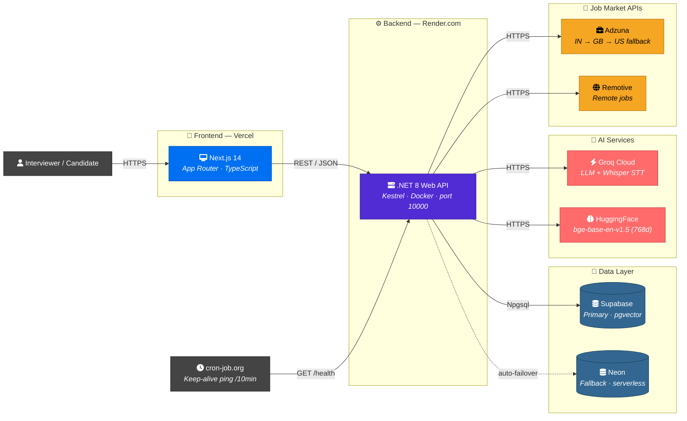
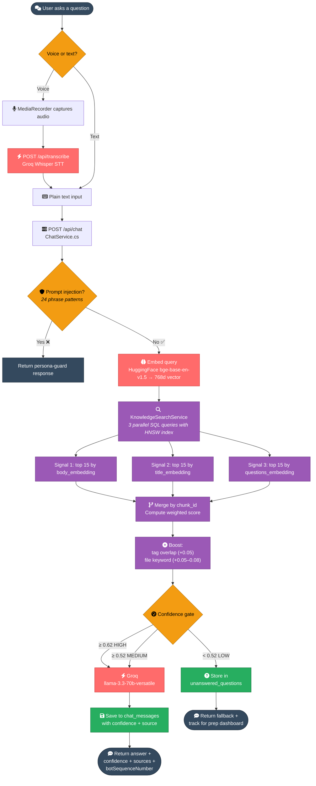
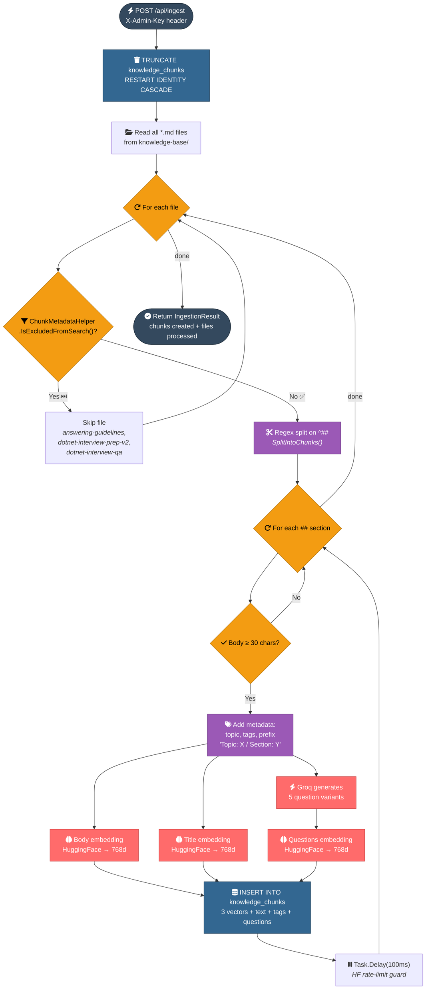
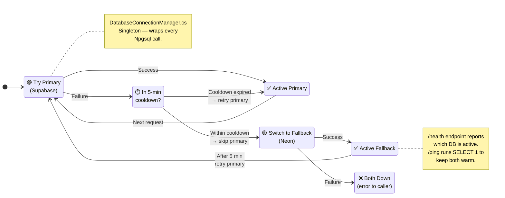
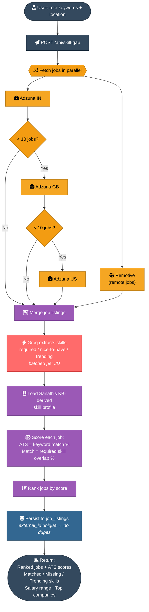
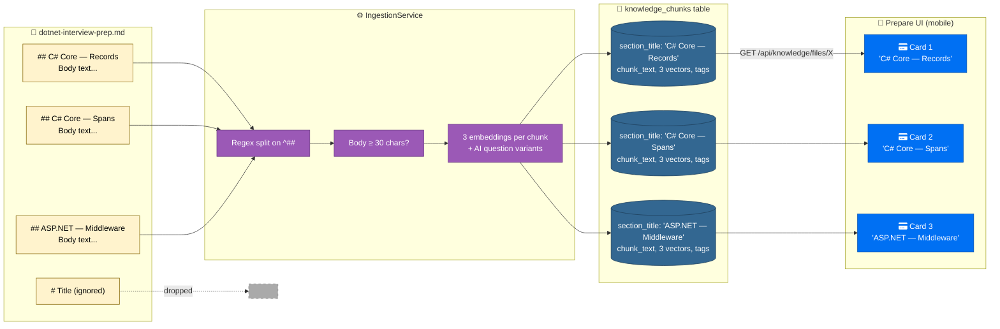
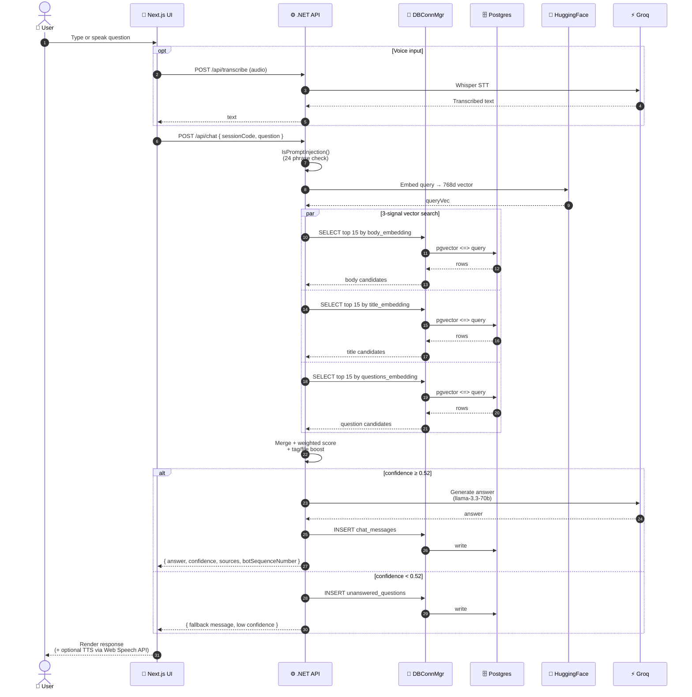

# Architecture Diagrams

> Visual reference for the Interview Bot system. All diagrams are Mermaid — GitHub renders them inline; in VSCode use the Mermaid Preview extension or open this on GitHub. Icons use FontAwesome via `fa:fa-…` plus emoji for clarity.
>
> For the prose explanation of each flow, see [README.md](README.md). For Claude Code's session context, see [CLAUDE.md](CLAUDE.md).

---

## 1. System Overview — Who talks to whom



---

## 2. Chat / RAG Flow — From question to answer



### Score formula (reference)

```
titleWeight = title_word_count >= 5 ? 0.30 : 0.15
bodyWeight  = title_word_count >= 5 ? 0.25 : 0.40
finalScore  = (questionsSim × 0.45)
            + (titleSim     × titleWeight)
            + (bodySim      × bodyWeight)
            + tag/file boost
```

---

## 3. Knowledge Base Ingestion Flow



---

## 4. Database Failover — Supabase ↔ Neon



---

## 5. Skill Gap Analyzer Flow



---

## 6. Knowledge Base — From .md file to UI card

How a single `##` heading in a markdown file flows all the way to a card in the prep UI.



**Key rule:** every `##` heading = one DB row = one UI card. Drop a `##` and you lose a card. Add one and you gain one. The `#` (h1) is dropped entirely.

---

## 7. Request Lifecycle — A single `/api/chat` call

Sequence diagram showing every actor involved when a question is asked.



---

## Color legend

| Color | Meaning |
|---|---|
| 🟦 Blue (`#0070f3`) | Frontend (Next.js / Vercel) |
| 🟪 Purple (`#512bd4` / `#9b59b6`) | Backend (.NET) / business logic |
| 🟫 Slate (`#336791`) | Postgres / database |
| 🟥 Coral (`#ff6b6b`) | AI services (Groq, HuggingFace) |
| 🟧 Amber (`#f5a623` / `#f39c12`) | External APIs / decision points |
| 🟩 Green (`#27ae60`) | Persistence / save actions |
| ⬛ Dark (`#34495e`) | User input / terminal nodes |

---

## Rendering these diagrams

- **GitHub** — renders inline automatically when you open this file in the repo.
- **VSCode** — install the [Mermaid Preview](https://marketplace.visualstudio.com/items?itemName=bierner.markdown-mermaid) extension; the built-in markdown preview will then render the diagrams.
- **Export to image** — paste a single ` ```mermaid ` block into [mermaid.live](https://mermaid.live) and use *Actions → PNG/SVG download*.
- **Embed elsewhere** — same: copy a single Mermaid block into any tool that supports Mermaid (Notion, Obsidian, Confluence, etc.).
